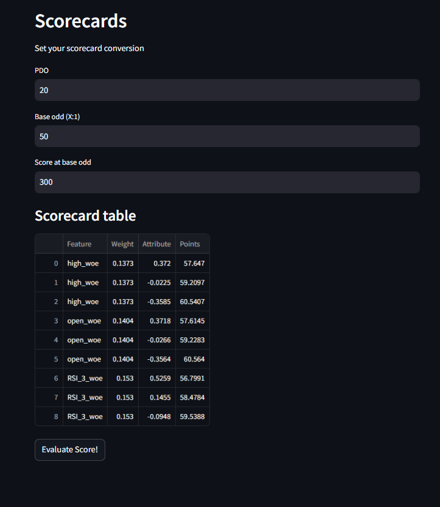
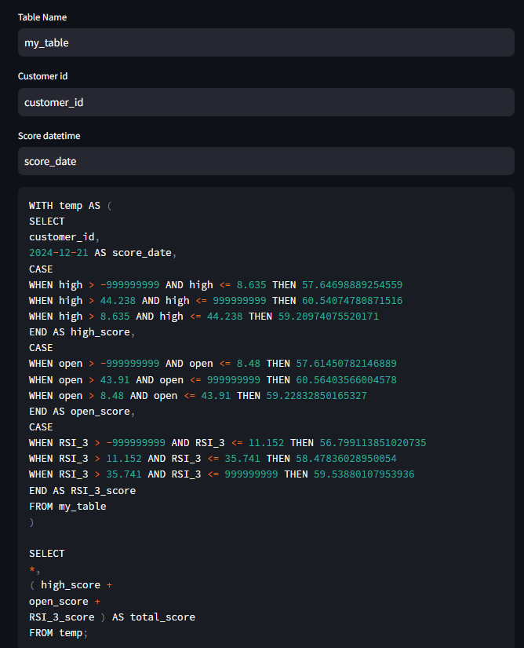

Simple and fast logistic regression based credit risk scoring based on streamlit.
## How to
```pip install requirements.txt```

then in the working folder:

```streamlit run main.py```

## Features

### File uploader


### Dropdown feature selector


### Convenient train/test splitting


### Automatic and manual binning


### IV and Correlation feature selection tool


### Hyperparameter tuning (L2)


### Scorecard and SQL creation tool




